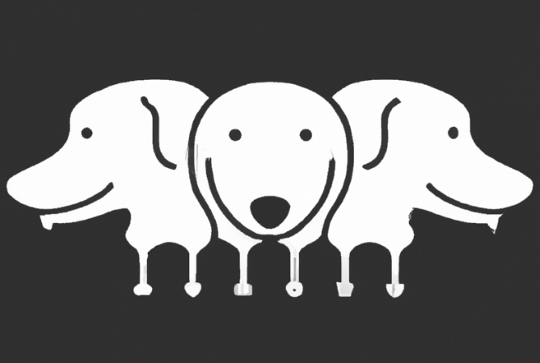

# Cerberes Front End

## Description

Cerberes is a secure, encrypted chat application. It uses PGP encryption to ensure the privacy of user communications. The messages transit through a server and are then deleted from the server once they've been delivered and decrypted by the recipient.

## Features

- PGP encryption for secure messages.
- Messages are deleted from the server once delivered.
- Users can generate and retrieve PGP keys using a mnemonic phrase.

## Tech Stack

- TypeScript
- Node.js
- Express.js
- Sequelize (ORM)
- PostgreSQL

## Getting Started

### Prerequisites

- Node.js
- PostgreSQL

### Installation

1. Clone the repository: `git clone https://github.com/SebastienPingal/cerberes_back_end.git`
2. Navigate to the project directory: `cd cerberes_back_end`
3. Install dependencies: `npm install`
4. Create a `.env` file and add your environment variables.
5. Run the application: `npm start`

## Usage

Provide information about how to use your app. You may want to include API routes here.

## Contributing

Please read `CONTRIBUTING.md` for details on our code of conduct, and the process for submitting pull requests to us.

## License

This project is licensed under the MIT License - see the `LICENSE.md` file for details.
